<div align="center">

# YAHA - Yet Another Host Aggregator

[](https://github.com/scottdraper8/yaha/actions/workflows/update-blocklist.yml)
[](https://www.python.org/downloads/)
[](https://github.com/pre-commit/pre-commit)

---

A blocklist aggregator that compiles multiple sources into two hosts files: one for general protection (ads, trackers, malware) and one including NSFW content blocking. Primarily designed for applications like [TrackerControl](https://f-droid.org/packages/net.kollnig.missioncontrol.fdroid/) that only support one blocklist URL.

---

</div>

## Usage

**General Protection (Ads, Trackers, Malware):**

```text
https://github.com/scottdraper8/yaha/releases/download/latest/hosts
```

**Complete Protection (Including NSFW Content):**

```text
https://github.com/scottdraper8/yaha/releases/download/latest/hosts_nsfw
```

> [!TIP]
> Copy either URL into any application that supports hosts-based blocking:
>
> - Use `hosts` for general protection (~3.3M domains)
> - Use `hosts_nsfw` for all the same domains in `hosts` ***plus*** adult content (**~7.9M domains**)

## How It Works

The workflow runs every 12 hours via GitHub Actions. It fetches all blocklists concurrently, computes SHA256 hashes of the content, and compares them against the previous run. If no content has changed, compilation is skipped. A weekly forced compilation runs on Sunday at midnight UTC regardless of changes.

```mermaid
%%{init: {'theme': 'dark', 'themeVariables': {
    'primaryColor': '#ff79c6',
    'secondaryColor': '#bd93f9',
    'tertiaryColor': '#44475a',
    'mainBkg': '#282a36',
    'nodeBorder': '#ff79c6',
    'clusterBkg': '#44475a',
    'clusterBorder': '#bd93f9',
    'textColor': '#f8f8f2'
}}}%%
flowchart LR
    Start([GitHub Actions Trigger<br/>Every 12 Hours])

    Start --> Init[Load State & Configuration]
    Init --> LoadWhitelist[Load Whitelist]
    LoadWhitelist --> LoadPSL[Load/Update PSL]
    LoadPSL --> CheckStale{Stale Lists?<br/>&gt;180 days}

    CheckStale -->|Yes| PurgeStale[Purge & Update Config]
    CheckStale -->|No| FetchPhase
    PurgeStale --> FetchPhase[Concurrent Fetch Phase]

    subgraph FetchPhase [" "]
        direction LR
        Fetch1[Fetch List 1<br/>+ SHA256]
        Fetch2[Fetch List 2<br/>+ SHA256]
        Fetch3[Fetch List 3<br/>+ SHA256]
        FetchN[Fetch List N<br/>+ SHA256]

        Fetch1 ~~~ Fetch2
        Fetch2 ~~~ Fetch3
        Fetch3 ~~~ FetchN
    end

    FetchPhase --> CompareHashes{Hash<br/>Changes?}

    CompareHashes -->|No Changes| ForceCheck{Weekly<br/>Force?}
    ForceCheck -->|No| Skip[Skip Compilation]
    ForceCheck -->|Yes| Pipeline

    CompareHashes -->|Changes| Pipeline[Processing Pipeline]

    subgraph Pipeline [" "]
        direction TB
        Parse[Parse All Formats<br/>hosts/raw/adblock]
        Parse --> Extract[Extract Base Domains<br/>PSL Lookup]
        Extract --> Annotate[Annotate Metadata<br/>list_id + is_general]
        Annotate --> Sort[External Sort<br/>by domain]
        Sort --> Dedupe[Streaming Deduplication<br/>+ Whitelist Filter]
        Dedupe --> SplitCalc[Split Outputs<br/>+ Calculate Stats]
    end

    Pipeline --> GenHosts[(hosts<br/>General Only)]
    Pipeline --> NSFWHosts[(hosts_nsfw<br/>Complete)]
    Pipeline --> UpdateStats[Update README Stats]

    UpdateStats --> SaveState[Save State]
    Skip --> SaveState

    SaveState --> Release{Compiled?}
    Release -->|Yes| CreateRelease[Create GitHub Release]
    Release -->|No| End([End])
    CreateRelease --> End

    GenHosts -.-> Apps[Applications<br/>TrackerControl, Pi-hole, etc]
    NSFWHosts -.-> Apps

    style Start fill:#44475a,stroke:#8be9fd,stroke-width:3px
    style CompareHashes fill:#44475a,stroke:#ffb86c,stroke-width:3px
    style ForceCheck fill:#44475a,stroke:#ffb86c,stroke-width:2px
    style Skip fill:#44475a,stroke:#50fa7b,stroke-width:2px
    style Pipeline fill:#44475a,stroke:#ff79c6,stroke-width:2px
    style FetchPhase fill:#44475a,stroke:#bd93f9,stroke-width:2px
    style GenHosts fill:#44475a,stroke:#50fa7b,stroke-width:2px
    style NSFWHosts fill:#44475a,stroke:#ff79c6,stroke-width:2px
    style End fill:#44475a,stroke:#8be9fd,stroke-width:2px
```



> [!NOTE]
> **Supported Formats:**
>
> - **Hosts file format**: `0.0.0.0 domain.com` or `127.0.0.1 domain.com`
> - **Raw domain lists**: One domain per line
> - **Adblock Plus filters**: `||domain.com^`

<!-- STATS_START -->

## Latest Run

<div align="center">


-7,888,620-ff79c6?style=for-the-badge&labelColor=6272a4)


### General Protection Lists

<table align="center">
<thead>
<tr>
<th>Source List</th>
<th>Total Domains</th>
<th>Unique Contribution</th>
</tr>
</thead>
<tbody>
<tr><td><a href='https://cdn.jsdelivr.net/gh/hagezi/dns-blocklists@latest/domains/dga30.txt'>HaGeZi DGA 30 Days</a></td><td>1,706,275</td><td>1,686,184</td></tr>
<tr><td><a href='https://cdn.jsdelivr.net/gh/hagezi/dns-blocklists@latest/hosts/tif.txt'>HaGeZi Threat Intelligence</a></td><td>607,757</td><td>438,165</td></tr>
<tr><td><a href='https://v.firebog.net/hosts/RPiList-Malware.txt'>RPiList Malware</a></td><td>429,947</td><td>278,721</td></tr>
<tr><td><a href='https://cdn.jsdelivr.net/gh/hagezi/dns-blocklists@latest/hosts/pro.txt'>HaGeZi Multi-pro Extended</a></td><td>340,900</td><td>209,498</td></tr>
<tr><td><a href='https://raw.githubusercontent.com/RooneyMcNibNug/pihole-stuff/master/SNAFU.txt'>SNAFU</a></td><td>72,224</td><td>66,143</td></tr>
<tr><td><a href='https://v.firebog.net/hosts/AdguardDNS.txt'>AdGuard DNS Filter</a></td><td>140,737</td><td>54,041</td></tr>
<tr><td><a href='https://raw.githubusercontent.com/anudeepND/blacklist/master/adservers.txt'>Anudeep's Blacklist</a></td><td>42,516</td><td>31,198</td></tr>
<tr><td><a href='https://hostfiles.frogeye.fr/firstparty-trackers-hosts.txt'>First-Party Trackers</a></td><td>32,224</td><td>23,409</td></tr>
<tr><td><a href='https://v.firebog.net/hosts/RPiList-Phishing.txt'>RPiList Phishing</a></td><td>155,494</td><td>21,739</td></tr>
<tr><td><a href='https://raw.githubusercontent.com/StevenBlack/hosts/master/hosts'>Steven Black's Unified Hosts</a></td><td>71,933</td><td>18,704</td></tr>
<tr><td><a href='https://lists.cyberhost.uk/malware.txt'>Cyber Threat Coalition Malware</a></td><td>20,688</td><td>16,943</td></tr>
<tr><td><a href='https://v.firebog.net/hosts/Prigent-Crypto.txt'>Prigent Crypto</a></td><td>16,288</td><td>15,898</td></tr>
<tr><td><a href='https://v.firebog.net/hosts/Easyprivacy.txt'>EasyPrivacy</a></td><td>42,353</td><td>15,176</td></tr>
<tr><td><a href='https://malware-filter.gitlab.io/malware-filter/phishing-filter-hosts.txt'>Phishing Hosts</a></td><td>20,303</td><td>11,011</td></tr>
<tr><td><a href='https://raw.githubusercontent.com/Spam404/lists/master/main-blacklist.txt'>Spam404</a></td><td>8,140</td><td>7,628</td></tr>
<tr><td><a href='https://raw.githubusercontent.com/PolishFiltersTeam/KADhosts/master/KADhosts.txt'>KADhosts</a></td><td>41,362</td><td>3,851</td></tr>
<tr><td><a href='https://raw.githubusercontent.com/DandelionSprout/adfilt/master/Alternate%20versions%20Anti-Malware%20List/AntiMalwareHosts.txt'>DandelionSprout Anti-Malware</a></td><td>15,194</td><td>3,415</td></tr>
<tr><td><a href='https://raw.githubusercontent.com/bigdargon/hostsVN/master/hosts'>hostsVN</a></td><td>17,334</td><td>3,274</td></tr>
<tr><td><a href='https://raw.githubusercontent.com/matomo-org/referrer-spam-blacklist/master/spammers.txt'>Matomo Referrer Spam</a></td><td>2,322</td><td>1,981</td></tr>
<tr><td><a href='https://v.firebog.net/hosts/Prigent-Ads.txt'>Prigent Ads</a></td><td>4,270</td><td>1,179</td></tr>
<tr><td><a href='https://raw.githubusercontent.com/AssoEchap/stalkerware-indicators/master/generated/hosts'>Stalkerware Indicators</a></td><td>919</td><td>541</td></tr>
<tr><td><a href='https://big.oisd.nl'>OISD Big List</a></td><td>0</td><td>0</td></tr>
</tbody>
</table>

### NSFW Blocking Lists

<table align="center">
<thead>
<tr>
<th>Source List</th>
<th>Total Domains</th>
<th>Unique Contribution</th>
</tr>
</thead>
<tbody>
<tr><td><a href='https://v.firebog.net/hosts/Prigent-Adult.txt'>Prigent Adult</a></td><td>4,646,408</td><td>4,557,909</td></tr>
<tr><td><a href='https://cdn.jsdelivr.net/gh/hagezi/dns-blocklists@latest/adblock/nsfw.txt'>HaGeZi NSFW</a></td><td>67,860</td><td>41,437</td></tr>
<tr><td><a href='https://nsfw.oisd.nl'>OISD NSFW</a></td><td>0</td><td>0</td></tr>
</tbody>
</table>

</div>

> [!NOTE]
> **Unique Contribution** indicates how many domains would be removed if that source were excluded.

<!-- STATS_END -->

---

> [!IMPORTANT]
> The section below is ***ONLY*** for developers who want to customize or contribute to YAHA.

## Local Development Setup

**Prerequisites:**

- Python 3.10 or higher

**Clone and setup:**

```bash
git clone https://github.com/scottdraper8/yaha.git
cd yaha
python3 -m venv .venv
source .venv/bin/activate  # On Windows: .venv\Scripts\activate
pip install -r requirements.txt
```

**Install pre-commit hooks:**

```bash
pip install pre-commit
pre-commit install
```

**Run locally:**

```bash
python compile_blocklist.py
```

Fetches all configured blocklists, parses domains, applies whitelist filters, deduplicates, generates both hosts files, and updates README statistics.

### Configuration

Blocklists are configured in `blocklists.json`.

**blocklists.json Format:**

```json
[
  {
    "name": "List Name",
    "url": "https://example.com/blocklist.txt",
    "nsfw": false,
    "preserve": false,
    "maintainer_name": "Maintainer Name",
    "maintainer_url": "https://github.com/maintainer",
    "maintainer_description": "Brief description of lists provided"
  }
]
```

Each entry requires:

- `name`: Display name for the blocklist
- `url`: Direct URL to the blocklist file

Optional fields:

- `nsfw`: Set to `true` to mark as NSFW content (included only in `hosts_nsfw`)
- `preserve`: Set to `true` to prevent auto-purge (see Change Detection below)
- `maintainer_name`: Maintainer's display name for acknowledgments section
- `maintainer_url`: URL to maintainer's repository or website
- `maintainer_description`: Description of what the maintainer provides

Maintainer fields are grouped and deduplicated in the acknowledgments section. When a list is purged, its maintainer is automatically removed from acknowledgments if no other active lists reference them.

#### Whitelist Configuration

Domains can be excluded from blocklists using `whitelist.txt`.

**whitelist.txt Format:**

```text
# One domain per line
# Lines starting with # are comments

# Exact domain match
example.com

# Wildcard match (all subdomains)
*.aurorastore.org
```

**Supported patterns:**

- **Exact match**: `example.com` - matches only that domain
- **Wildcard match**: `*.example.com` - matches the domain and all subdomains

Whitelisted domains are filtered during the deduplication pass.

### Performance Configuration

In `compile_blocklist.py`, you can adjust these constants:

- `MAX_WORKERS = 5`: Maximum concurrent blocklist fetches
- `REQUEST_TIMEOUT = 30`: Request timeout in seconds
- `STALE_THRESHOLD_DAYS = 180`: Days before inactive lists are auto-purged

> [!WARNING]
> If you add many sources or experience rate limiting, adjust `MAX_WORKERS` to control concurrency.

### Change Detection

Hash-based change detection determines whether compilation is necessary:

- **Hash comparison**: Each blocklist's content is hashed (SHA256). If no hashes change between runs, compilation is skipped.
- **State tracking**: `state.json` stores hash history, fetch counts, and change timestamps.
- **Auto-purge**: Lists that haven't updated in 180+ days are removed from `blocklists.json`.
- **Preserve flag**: Set `"preserve": true` to prevent auto-purge for specific lists.
- **Weekly forced compilation**: Runs every Sunday at midnight UTC regardless of hash changes.

## Acknowledgments

<!-- ACKNOWLEDGMENTS_START -->

Thanks to the maintainers of all source blocklists:

- [Steven Black](https://github.com/StevenBlack/hosts) - Unified hosts file
- [OISD](https://oisd.nl/) - Big List & NSFW blocklists
- [HaGeZi](https://github.com/hagezi/dns-blocklists) - Multi-pro, Threat Intelligence, DGA, and NSFW lists
- [Firebog](https://firebog.net/) - RPiList Phishing/Malware, Prigent collections, AdGuard DNS, EasyPrivacy, W3KBL
- [RooneyMcNibNug](https://github.com/RooneyMcNibNug/pihole-stuff) - SNAFU
- [Anudeep ND](https://github.com/anudeepND/blacklist) - Adservers blacklist
- [Frogeye](https://hostfiles.frogeye.fr/) - First-party trackers
- [Cyber Threat Coalition](https://cyberthreatcoalition.org/) - Malware blocklist
- [Spam404](https://github.com/Spam404/lists) - Main blacklist
- [Polish Filters Team](https://github.com/PolishFiltersTeam/KADhosts) - KADhosts
- [bigdargon](https://github.com/bigdargon/hostsVN) - hostsVN
- [DandelionSprout](https://github.com/DandelionSprout/adfilt) - Anti-Malware List
- [Matomo](https://github.com/matomo-org/referrer-spam-blacklist) - Referrer spam blacklist
- [AssoEchap](https://github.com/AssoEchap/stalkerware-indicators) - Stalkerware indicators
- [Malware Filter](https://gitlab.com/malware-filter/phishing-filter) - Phishing filter

<!-- ACKNOWLEDGMENTS_END -->
