<div align="center">

# YAHA - Yet Another Host Aggregator

[](https://github.com/scottdraper8/yaha/actions/workflows/update-blocklist.yml)
[](https://www.python.org/downloads/)
[](https://python-poetry.org/)
[](https://github.com/pre-commit/pre-commit)
[](https://github.com/yifeikong/curl_cffi)

---

Automated blocklist aggregator compiling millions of domains from
multiple sources. Blocks ads, trackers, malware, and optionally NSFW
content. Perfect for applications like
[TrackerControl](https://f-droid.org/packages/net.kollnig.missioncontrol.fdroid/),
Pi-hole, and other DNS/hosts-based blockers.

---

</div>

## Usage

**General Protection (Ads, Trackers, Malware):**

```text
https://github.com/scottdraper8/yaha/releases/download/latest/hosts
```

**Complete Protection (Including NSFW Content):**

```text
https://github.com/scottdraper8/yaha/releases/download/latest/hosts_nsfw
```

> [!TIP]
> Copy either URL into any application that supports hosts-based blocking:
>
> - Use `hosts` for general protection
> - Use `hosts_nsfw` for all the same domains in `hosts` ***plus*** adult content

## How It Works

Runs automatically twice daily via GitHub Actions. Sources are fetched
in parallel and checked for changes. If content is unchanged,
compilation is skipped to save resources. A weekly forced run ensures
the lists stay fresh regardless of source changes.

```mermaid
%%{init: {'theme': 'dark', 'themeVariables': {
    'primaryColor': '#ff79c6',
    'secondaryColor': '#bd93f9',
    'tertiaryColor': '#44475a',
    'mainBkg': '#282a36',
    'nodeBorder': '#ff79c6',
    'clusterBkg': '#44475a',
    'clusterBorder': '#bd93f9',
    'textColor': '#f8f8f2'
}}}%%
flowchart LR
    Start([Runs Twice Daily<br/>via GitHub Actions])

    Start --> Fetch[Concurrent Fetch<br/>20+ Sources]
    Fetch --> HashCheck{Content<br/>Changed?}

    HashCheck -->|No| Weekly{Weekly<br/>Force?}
    Weekly -->|No| Skip[Skip Compilation]
    Weekly -->|Yes| Compile

    HashCheck -->|Yes| Compile[Process & Dedupe<br/>Multi-Format Support]

    Compile --> Split{Category}
    Split -->|General| GenHosts[(hosts<br/>General)]
    Split -->|NSFW| NSFWHosts[(hosts_nsfw<br/>Complete)]

    GenHosts --> Release[GitHub Release]
    NSFWHosts --> Release

    Skip --> End([End])
    Release --> End

    style Start fill:#44475a,stroke:#8be9fd,stroke-width:3px
    style HashCheck fill:#44475a,stroke:#ffb86c,stroke-width:3px
    style Compile fill:#44475a,stroke:#ff79c6,stroke-width:2px
    style GenHosts fill:#44475a,stroke:#50fa7b,stroke-width:2px
    style NSFWHosts fill:#44475a,stroke:#ff79c6,stroke-width:2px
    style Release fill:#44475a,stroke:#bd93f9,stroke-width:2px
```



<!-- STATS_START -->

## Latest Run

<div align="center">


-7,865,211-ff79c6?style=for-the-badge&labelColor=6272a4)


### General Protection Lists

<table align="center">
<!-- markdownlint-disable MD013 -->
<thead>
<tr>
<th>Source List</th>
<th>Total Domains</th>
<th>Unique Contribution</th>
</tr>
</thead>
<tbody>
<tr><td><a href='https://cdn.jsdelivr.net/gh/hagezi/dns-blocklists@latest/domains/dga30.txt'>HaGeZi DGA 30 Days</a></td><td>1,706,275</td><td>1,686,184</td></tr>
<tr><td><a href='https://cdn.jsdelivr.net/gh/hagezi/dns-blocklists@latest/hosts/tif.txt'>HaGeZi Threat Intelligence</a></td><td>607,757</td><td>438,165</td></tr>
<tr><td><a href='https://v.firebog.net/hosts/RPiList-Malware.txt'>RPiList Malware</a></td><td>429,947</td><td>278,721</td></tr>
<tr><td><a href='https://cdn.jsdelivr.net/gh/hagezi/dns-blocklists@latest/hosts/pro.txt'>HaGeZi Multi-pro Extended</a></td><td>340,900</td><td>210,527</td></tr>
<tr><td><a href='https://raw.githubusercontent.com/RooneyMcNibNug/pihole-stuff/master/SNAFU.txt'>SNAFU</a></td><td>72,224</td><td>66,650</td></tr>
<tr><td><a href='https://v.firebog.net/hosts/AdguardDNS.txt'>AdGuard DNS Filter</a></td><td>140,737</td><td>54,271</td></tr>
<tr><td><a href='https://raw.githubusercontent.com/anudeepND/blacklist/master/adservers.txt'>Anudeep's Blacklist</a></td><td>42,516</td><td>31,613</td></tr>
<tr><td><a href='https://v.firebog.net/hosts/RPiList-Phishing.txt'>RPiList Phishing</a></td><td>155,494</td><td>21,739</td></tr>
<tr><td><a href='https://raw.githubusercontent.com/StevenBlack/hosts/master/hosts'>Steven Black's Unified Hosts</a></td><td>71,933</td><td>18,718</td></tr>
<tr><td><a href='https://lists.cyberhost.uk/malware.txt'>Cyber Threat Coalition Malware</a></td><td>20,688</td><td>16,943</td></tr>
<tr><td><a href='https://v.firebog.net/hosts/Easyprivacy.txt'>EasyPrivacy</a></td><td>42,353</td><td>16,559</td></tr>
<tr><td><a href='https://v.firebog.net/hosts/Prigent-Crypto.txt'>Prigent Crypto</a></td><td>16,288</td><td>15,898</td></tr>
<tr><td><a href='https://malware-filter.gitlab.io/malware-filter/phishing-filter-hosts.txt'>Phishing Hosts</a></td><td>20,303</td><td>11,011</td></tr>
<tr><td><a href='https://raw.githubusercontent.com/Spam404/lists/master/main-blacklist.txt'>Spam404</a></td><td>8,140</td><td>7,628</td></tr>
<tr><td><a href='https://raw.githubusercontent.com/PolishFiltersTeam/KADhosts/master/KADhosts.txt'>KADhosts</a></td><td>41,362</td><td>3,851</td></tr>
<tr><td><a href='https://raw.githubusercontent.com/DandelionSprout/adfilt/master/Alternate%20versions%20Anti-Malware%20List/AntiMalwareHosts.txt'>DandelionSprout Anti-Malware</a></td><td>15,194</td><td>3,415</td></tr>
<tr><td><a href='https://raw.githubusercontent.com/bigdargon/hostsVN/master/hosts'>hostsVN</a></td><td>17,334</td><td>3,280</td></tr>
<tr><td><a href='https://raw.githubusercontent.com/matomo-org/referrer-spam-blacklist/master/spammers.txt'>Matomo Referrer Spam</a></td><td>2,322</td><td>1,981</td></tr>
<tr><td><a href='https://v.firebog.net/hosts/Prigent-Ads.txt'>Prigent Ads</a></td><td>4,270</td><td>1,185</td></tr>
<tr><td><a href='https://raw.githubusercontent.com/AssoEchap/stalkerware-indicators/master/generated/hosts'>Stalkerware Indicators</a></td><td>919</td><td>541</td></tr>
</tbody>
</table>
<!-- markdownlint-enable MD013 -->

### NSFW Blocking Lists

<table align="center">
<!-- markdownlint-disable MD013 -->
<thead>
<tr>
<th>Source List</th>
<th>Total Domains</th>
<th>Unique Contribution</th>
</tr>
</thead>
<tbody>
<tr><td><a href='https://v.firebog.net/hosts/Prigent-Adult.txt'>Prigent Adult</a></td><td>4,646,408</td><td>4,557,909</td></tr>
<tr><td><a href='https://cdn.jsdelivr.net/gh/hagezi/dns-blocklists@latest/adblock/nsfw.txt'>HaGeZi NSFW</a></td><td>67,860</td><td>41,437</td></tr>
</tbody>
</table>
<!-- markdownlint-enable MD013 -->

</div>

> [!NOTE]
> **Unique Contribution** shows how many domains would disappear if that source were removed.
> Sources with low unique counts (~50 or less) provide minimal value.

<!-- STATS_END -->

---

> [!IMPORTANT]
> The section below is ***ONLY*** for developers who want to
> customize or contribute to YAHA.

## Local Development Setup

**Prerequisites:**

- Python 3.11 or higher
- [Poetry](https://python-poetry.org/docs/#installation) for dependency
  management

**Clone and setup:**

```bash
git clone https://github.com/scottdraper8/yaha.git
cd yaha
poetry install
```

**Install pre-commit hooks:**

```bash
poetry run pre-commit install
```

**Run locally:**

```bash
# Normal run (skips if no changes detected)
poetry run yaha

# Force recompilation (ignores hash checks)
poetry run yaha --force

# Compile from cached sources (no network requests)
poetry run yaha --compile-only
```

The compiler fetches all configured sources, parses domains, applies
whitelist filters, deduplicates, generates both hosts files, and updates
README statistics.

> [!TIP]
> Use `--compile-only` after code changes that affect domain processing.
> This recompiles from cached sources without fetching, useful when you
> need to regenerate lists with new logic but source content hasn't
> changed.

### Project Structure

```text
yaha/
├── src/                     # Source code (modular, zero-knowledge components)
│   ├── cache_manager.py     # Source content caching for compile-only mode
│   ├── cli.py               # Main orchestrator (business logic)
│   ├── config.py            # Configuration loading and validation
│   ├── domain_processor.py  # Domain extraction and validation
│   ├── fetcher.py           # HTTP fetching with hash computation
│   ├── hosts_generator.py   # Hosts file generation
│   ├── pipeline.py          # Deduplication and contribution stats
│   └── state_manager.py     # State persistence and staleness checks
├── tests/                   # Comprehensive test suite (83 tests)
├── blocklists.json          # Source configuration
├── whitelist.txt            # Domain whitelist
├── state.json               # Runtime state (hashes, timestamps)
├── pyproject.toml           # Poetry configuration
└── .pre-commit-config.yaml  # Pre-commit hooks
```

### Development Workflow

**Run tests:**

```bash
# Run all tests
poetry run pytest

# Run with coverage report
poetry run pytest --cov=src --cov-report=term-missing

# Run specific test file
poetry run pytest tests/test_domain_processor.py
```

**Code quality checks:**

```bash
# Linting (with auto-fix)
poetry run ruff check src/ tests/ --fix

# Formatting
poetry run ruff format src/ tests/

# Type checking
poetry run mypy src/

# Run all pre-commit hooks
poetry run pre-commit run --all-files
```

### Configuration

Blocklists are configured in `blocklists.json`.

**blocklists.json Format:**

```json
[
  {
    "name": "List Name",
    "url": "https://example.com/blocklist.txt",
    "nsfw": false,
    "preserve": false,
    "maintainer_name": "Maintainer Name",
    "maintainer_url": "https://github.com/maintainer",
    "maintainer_description": "Brief description of lists provided"
  }
]
```

Each entry requires:

- `name`: Display name for the blocklist
- `url`: Direct URL to the blocklist file

Optional fields:

- `nsfw`: Set to `true` to mark as NSFW content (included only in
  `hosts_nsfw`)
- `preserve`: Set to `true` to prevent auto-purge (see Change Detection
  below)
- `maintainer_name`: Maintainer's display name for acknowledgments section
- `maintainer_url`: URL to maintainer's repository or website
- `maintainer_description`: Description of what the maintainer provides

Maintainer fields are grouped and deduplicated in the acknowledgments
section. When a list is purged, its maintainer is automatically removed
from acknowledgments if no other active lists reference them.

#### Whitelist Configuration

Domains can be excluded from blocklists using `whitelist.txt`.

**whitelist.txt Format:**

```text
# One domain per line
# Lines starting with # are comments

# Exact domain match
example.com

# Wildcard match (all subdomains)
*.aurorastore.org
```

**Supported patterns:**

- **Exact match**: `example.com` - matches only that domain
- **Wildcard match**: `*.example.com` - matches the domain and all
  subdomains

Whitelisted domains are filtered during the deduplication pass.

### Performance Tuning

In `src/cli.py`, adjust these constants:

- `MAX_WORKERS = 5`: Maximum concurrent source fetches
- `REQUEST_TIMEOUT = 30`: HTTP request timeout in seconds

In `src/state_manager.py`:

- `STALE_THRESHOLD_DAYS = 180`: Days before inactive sources are
  auto-purged

> [!WARNING]
> If you add many sources or experience rate limiting, reduce
> `MAX_WORKERS` to control concurrency.

## Acknowledgments

<!-- ACKNOWLEDGMENTS_START -->

Thanks to the maintainers of all source blocklists:

- [Anudeep ND](https://github.com/anudeepND/blacklist) - Adservers blacklist
- [AssoEchap](https://github.com/AssoEchap/stalkerware-indicators) - Stalkerware indicators
- [Cyber Threat Coalition](https://cyberthreatcoalition.org/) - Malware blocklist
- [DandelionSprout](https://github.com/DandelionSprout/adfilt) - Anti-Malware List
- [Firebog](https://firebog.net/) - RPiList Phishing/Malware, Prigent collections, AdGuard DNS, EasyPrivacy
- [HaGeZi](https://github.com/hagezi/dns-blocklists) - Multi-pro, Threat Intelligence, DGA, and NSFW lists
- [Malware Filter](https://gitlab.com/malware-filter/phishing-filter) - Phishing filter
- [Matomo](https://github.com/matomo-org/referrer-spam-blacklist) - Referrer spam blacklist
- [Polish Filters Team](https://github.com/PolishFiltersTeam/KADhosts) - KADhosts
- [RooneyMcNibNug](https://github.com/RooneyMcNibNug/pihole-stuff) - SNAFU
- [Spam404](https://github.com/Spam404/lists) - Main blacklist
- [Steven Black](https://github.com/StevenBlack/hosts) - Unified hosts file
- [bigdargon](https://github.com/bigdargon/hostsVN) - hostsVN

<!-- ACKNOWLEDGMENTS_END -->
