<div align="center">

# YAHA - Yet Another Host Aggregator

[](https://github.com/scottdraper8/yaha/actions/workflows/update-blocklist.yml)
[](https://www.python.org/downloads/)
[](https://python-poetry.org/)
[](https://github.com/pre-commit/pre-commit)

---

A blocklist aggregator that compiles multiple sources into two hosts files: one for general protection (ads, trackers, malware) and one including NSFW content blocking. Primarily designed for applications like [TrackerControl](https://f-droid.org/packages/net.kollnig.missioncontrol.fdroid/) that only support one blocklist URL.

---

</div>

## Usage

**General Protection (Ads, Trackers, Malware):**

```text
https://github.com/scottdraper8/yaha/releases/download/latest/hosts
```

**Complete Protection (Including NSFW Content):**

```text
https://github.com/scottdraper8/yaha/releases/download/latest/hosts_nsfw
```

> [!TIP]
> Copy either URL into any application that supports hosts-based blocking:
>
> - Use `hosts` for general protection (~2.8M domains)
> - Use `hosts_nsfw` for all the same domains in `hosts` ***plus*** adult content (**~3.6M domains**)

## How It Works

The workflow runs every 12 hours via GitHub Actions. It fetches all blocklists concurrently, computes SHA256 hashes of the content, and compares them against the previous run. If no content has changed, compilation is skipped. A weekly forced compilation runs on Sunday at midnight UTC regardless of changes.

```mermaid
%%{init: {'theme': 'dark', 'themeVariables': {
    'primaryColor': '#ff79c6',
    'secondaryColor': '#bd93f9',
    'tertiaryColor': '#44475a',
    'mainBkg': '#282a36',
    'nodeBorder': '#ff79c6',
    'clusterBkg': '#44475a',
    'clusterBorder': '#bd93f9',
    'textColor': '#f8f8f2'
}}}%%
flowchart LR
    Start([GitHub Actions Trigger<br/>Every 12 Hours])

    Start --> Init[Load State & Config]
    Init --> LoadWhitelist[Load Whitelist]
    LoadWhitelist --> LoadPSL[Download/Load PSL]
    LoadPSL --> CheckStale{Stale Sources?<br/>&gt;180 days}

    CheckStale -->|Yes| PurgeStale[Purge & Save Config]
    CheckStale -->|No| FetchPhase
    PurgeStale --> FetchPhase[Concurrent Fetch]

    subgraph FetchPhase [" "]
        direction LR
        Fetch1[Source 1<br/>SHA256 Hash]
        Fetch2[Source 2<br/>SHA256 Hash]
        Fetch3[Source 3<br/>SHA256 Hash]
        FetchN[Source N<br/>SHA256 Hash]

        Fetch1 ~~~ Fetch2
        Fetch2 ~~~ Fetch3
        Fetch3 ~~~ FetchN
    end

    FetchPhase --> CompareHashes{Hash<br/>Changed?}

    CompareHashes -->|No Changes| ForceCheck{Weekly<br/>Force?}
    ForceCheck -->|No| Skip[Skip Compilation]
    ForceCheck -->|Yes| Pipeline

    CompareHashes -->|Changes| Pipeline[Processing Pipeline]

    subgraph Pipeline [" "]
        direction TB
        Parse[Parse Formats<br/>hosts/raw/adblock]
        Parse --> Extract[Extract Registrable<br/>Domains via PSL]
        Extract --> Annotate[Annotate Stream<br/>source_id + category]
        Annotate --> Sort[External Sort<br/>by domain + source]
        Sort --> Dedupe[Stream Dedup<br/>+ Whitelist Filter]
        Dedupe --> Stats[Calculate<br/>Contributions]
    end

    Pipeline --> GenHosts[(hosts<br/>General Only)]
    Pipeline --> NSFWHosts[(hosts_nsfw<br/>Complete)]
    Pipeline --> UpdateREADME[Update README]

    UpdateREADME --> SaveState[Save State]
    Skip --> SaveState

    SaveState --> Release{Compiled?}
    Release -->|Yes| CreateRelease[GitHub Release]
    Release -->|No| End([End])
    CreateRelease --> End

    GenHosts -.-> Apps[Applications<br/>TrackerControl, Pi-hole, etc]
    NSFWHosts -.-> Apps

    style Start fill:#44475a,stroke:#8be9fd,stroke-width:3px
    style CompareHashes fill:#44475a,stroke:#ffb86c,stroke-width:3px
    style ForceCheck fill:#44475a,stroke:#ffb86c,stroke-width:2px
    style Skip fill:#44475a,stroke:#50fa7b,stroke-width:2px
    style Pipeline fill:#44475a,stroke:#ff79c6,stroke-width:2px
    style FetchPhase fill:#44475a,stroke:#bd93f9,stroke-width:2px
    style GenHosts fill:#44475a,stroke:#50fa7b,stroke-width:2px
    style NSFWHosts fill:#44475a,stroke:#ff79c6,stroke-width:2px
    style End fill:#44475a,stroke:#8be9fd,stroke-width:2px
```



> [!NOTE]
> **Supported Formats:**
>
> - **Hosts file format**: `0.0.0.0 domain.com` or `127.0.0.1 domain.com`
> - **Raw domain lists**: One domain per line
> - **Adblock Plus filters**: `||domain.com^`

<!-- STATS_START -->

## Latest Run

<div align="center">


-3,566,158-ff79c6?style=for-the-badge&labelColor=6272a4)


### General Protection Lists

<table align="center">
<thead>
<tr>
<th>Source List</th>
<th>Total Domains</th>
<th>Unique Contribution</th>
</tr>
</thead>
<tbody>
<tr><td><a href='https://cdn.jsdelivr.net/gh/hagezi/dns-blocklists@latest/domains/dga30.txt'>HaGeZi DGA 30 Days</a></td><td>1,706,275</td><td>1,685,855</td></tr>
<tr><td><a href='https://cdn.jsdelivr.net/gh/hagezi/dns-blocklists@latest/hosts/tif.txt'>HaGeZi Threat Intelligence</a></td><td>607,757</td><td>394,458</td></tr>
<tr><td><a href='https://v.firebog.net/hosts/RPiList-Malware.txt'>RPiList Malware</a></td><td>429,947</td><td>234,597</td></tr>
<tr><td><a href='https://v.firebog.net/hosts/AdguardDNS.txt'>AdGuard DNS Filter</a></td><td>140,737</td><td>48,666</td></tr>
<tr><td><a href='https://cdn.jsdelivr.net/gh/hagezi/dns-blocklists@latest/hosts/pro.txt'>HaGeZi Multi-pro Extended</a></td><td>340,900</td><td>41,515</td></tr>
<tr><td><a href='https://lists.cyberhost.uk/malware.txt'>Cyber Threat Coalition Malware</a></td><td>20,688</td><td>15,441</td></tr>
<tr><td><a href='https://v.firebog.net/hosts/Prigent-Crypto.txt'>Prigent Crypto</a></td><td>16,288</td><td>13,666</td></tr>
<tr><td><a href='https://v.firebog.net/hosts/Easyprivacy.txt'>EasyPrivacy</a></td><td>42,353</td><td>7,231</td></tr>
<tr><td><a href='https://raw.githubusercontent.com/Spam404/lists/master/main-blacklist.txt'>Spam404</a></td><td>8,140</td><td>7,002</td></tr>
<tr><td><a href='https://raw.githubusercontent.com/StevenBlack/hosts/master/hosts'>Steven Black's Unified Hosts</a></td><td>71,933</td><td>6,859</td></tr>
<tr><td><a href='https://malware-filter.gitlab.io/malware-filter/phishing-filter-hosts.txt'>Phishing Hosts</a></td><td>20,303</td><td>6,115</td></tr>
<tr><td><a href='https://hostfiles.frogeye.fr/firstparty-trackers-hosts.txt'>First-Party Trackers</a></td><td>32,224</td><td>5,221</td></tr>
<tr><td><a href='https://raw.githubusercontent.com/DandelionSprout/adfilt/master/Alternate%20versions%20Anti-Malware%20List/AntiMalwareHosts.txt'>DandelionSprout Anti-Malware</a></td><td>15,194</td><td>3,386</td></tr>
<tr><td><a href='https://raw.githubusercontent.com/matomo-org/referrer-spam-blacklist/master/spammers.txt'>Matomo Referrer Spam</a></td><td>2,322</td><td>1,975</td></tr>
<tr><td><a href='https://v.firebog.net/hosts/RPiList-Phishing.txt'>RPiList Phishing</a></td><td>155,494</td><td>1,737</td></tr>
<tr><td><a href='https://raw.githubusercontent.com/anudeepND/blacklist/master/adservers.txt'>Anudeep's Blacklist</a></td><td>42,516</td><td>1,374</td></tr>
<tr><td><a href='https://raw.githubusercontent.com/RooneyMcNibNug/pihole-stuff/master/SNAFU.txt'>SNAFU</a></td><td>72,224</td><td>1,001</td></tr>
<tr><td><a href='https://v.firebog.net/hosts/Prigent-Ads.txt'>Prigent Ads</a></td><td>4,270</td><td>800</td></tr>
<tr><td><a href='https://raw.githubusercontent.com/bigdargon/hostsVN/master/hosts'>hostsVN</a></td><td>17,334</td><td>426</td></tr>
<tr><td><a href='https://raw.githubusercontent.com/PolishFiltersTeam/KADhosts/master/KADhosts.txt'>KADhosts</a></td><td>41,362</td><td>363</td></tr>
<tr><td><a href='https://raw.githubusercontent.com/AssoEchap/stalkerware-indicators/master/generated/hosts'>Stalkerware Indicators</a></td><td>919</td><td>221</td></tr>
<tr><td><a href='https://big.oisd.nl'>OISD Big List</a></td><td>0</td><td>0</td></tr>
</tbody>
</table>

### NSFW Blocking Lists

<table align="center">
<thead>
<tr>
<th>Source List</th>
<th>Total Domains</th>
<th>Unique Contribution</th>
</tr>
</thead>
<tbody>
<tr><td><a href='https://v.firebog.net/hosts/Prigent-Adult.txt'>Prigent Adult</a></td><td>4,646,408</td><td>735,331</td></tr>
<tr><td><a href='https://cdn.jsdelivr.net/gh/hagezi/dns-blocklists@latest/adblock/nsfw.txt'>HaGeZi NSFW</a></td><td>67,860</td><td>40,263</td></tr>
<tr><td><a href='https://nsfw.oisd.nl'>OISD NSFW</a></td><td>0</td><td>0</td></tr>
</tbody>
</table>

</div>

> [!NOTE]
> **Unique Contribution** shows how many domains would disappear if that source were removed.
> Sources with low unique counts (~50 or less) provide minimal value.

<!-- STATS_END -->

---

> [!IMPORTANT]
> The section below is ***ONLY*** for developers who want to customize or contribute to YAHA.

## Local Development Setup

**Prerequisites:**

- Python 3.11 or higher
- [Poetry](https://python-poetry.org/docs/#installation) for dependency management

**Clone and setup:**

```bash
git clone https://github.com/scottdraper8/yaha.git
cd yaha
poetry install
```

**Install pre-commit hooks:**

```bash
poetry run pre-commit install
```

**Run locally:**

```bash
# Normal run (skips if no changes detected)
poetry run yaha

# Force recompilation (ignores hash checks)
poetry run yaha --force
```

The compiler fetches all configured sources, parses domains, applies whitelist filters, deduplicates, generates both hosts files, and updates README statistics.

### Project Structure

```text
yaha/
├── src/                     # Source code (modular, zero-knowledge components)
│   ├── cli.py               # Main orchestrator (business logic)
│   ├── config.py            # Configuration loading and validation
│   ├── domain_processor.py  # PSL-based domain extraction
│   ├── fetcher.py           # HTTP fetching with hash computation
│   ├── hosts_generator.py   # Hosts file generation
│   ├── pipeline.py          # Deduplication and contribution stats
│   └── state_manager.py     # State persistence and staleness checks
├── tests/                   # Comprehensive test suite (78 tests)
├── blocklists.json          # Source configuration
├── whitelist.txt            # Domain whitelist
├── state.json               # Runtime state (hashes, timestamps)
├── pyproject.toml           # Poetry configuration
└── .pre-commit-config.yaml  # Pre-commit hooks
```

### Development Workflow

**Run tests:**

```bash
# Run all tests
poetry run pytest

# Run with coverage report
poetry run pytest --cov=src --cov-report=term-missing

# Run specific test file
poetry run pytest tests/test_domain_processor.py
```

**Code quality checks:**

```bash
# Linting (with auto-fix)
poetry run ruff check src/ tests/ --fix

# Formatting
poetry run ruff format src/ tests/

# Type checking
poetry run mypy src/

# Run all pre-commit hooks
poetry run pre-commit run --all-files
```

### Configuration

Blocklists are configured in `blocklists.json`.

**blocklists.json Format:**

```json
[
  {
    "name": "List Name",
    "url": "https://example.com/blocklist.txt",
    "nsfw": false,
    "preserve": false,
    "maintainer_name": "Maintainer Name",
    "maintainer_url": "https://github.com/maintainer",
    "maintainer_description": "Brief description of lists provided"
  }
]
```

Each entry requires:

- `name`: Display name for the blocklist
- `url`: Direct URL to the blocklist file

Optional fields:

- `nsfw`: Set to `true` to mark as NSFW content (included only in `hosts_nsfw`)
- `preserve`: Set to `true` to prevent auto-purge (see Change Detection below)
- `maintainer_name`: Maintainer's display name for acknowledgments section
- `maintainer_url`: URL to maintainer's repository or website
- `maintainer_description`: Description of what the maintainer provides

Maintainer fields are grouped and deduplicated in the acknowledgments section. When a list is purged, its maintainer is automatically removed from acknowledgments if no other active lists reference them.

#### Whitelist Configuration

Domains can be excluded from blocklists using `whitelist.txt`.

**whitelist.txt Format:**

```text
# One domain per line
# Lines starting with # are comments

# Exact domain match
example.com

# Wildcard match (all subdomains)
*.aurorastore.org
```

**Supported patterns:**

- **Exact match**: `example.com` - matches only that domain
- **Wildcard match**: `*.example.com` - matches the domain and all subdomains

Whitelisted domains are filtered during the deduplication pass.

### Architecture

YAHA follows a modular, zero-knowledge architecture where each component is designed to be reusable and unaware of the specific business domain:

- **`config.py`**: Loads and validates source configurations and whitelist
- **`domain_processor.py`**: Extracts registrable domains using Public Suffix List rules (no knowledge of "blocklists")
- **`fetcher.py`**: Generic HTTP fetching with SHA256 hashing (no knowledge of domains)
- **`pipeline.py`**: Generic deduplication and contribution tracking using external sort (no knowledge of "blocklists" or "NSFW")
- **`hosts_generator.py`**: Generic hosts file I/O (no knowledge of sources or categories)
- **`state_manager.py`**: Persists state and detects staleness (no knowledge of "NSFW" or specific business rules)
- **`cli.py`**: Main orchestrator containing all business logic (knows about "blocklists", "NSFW", purging rules, etc.)

This separation ensures components remain maintainable and testable in isolation.

### Performance Tuning

In `src/cli.py`, adjust these constants:

- `MAX_WORKERS = 5`: Maximum concurrent source fetches
- `REQUEST_TIMEOUT = 30`: HTTP request timeout in seconds

In `src/state_manager.py`:

- `STALE_THRESHOLD_DAYS = 180`: Days before inactive sources are auto-purged

> [!WARNING]
> If you add many sources or experience rate limiting, reduce `MAX_WORKERS` to control concurrency.

### Change Detection

Hash-based change detection determines whether compilation is necessary:

- **Hash comparison**: Each source's content is hashed (SHA256). If no hashes change between runs, compilation is skipped
- **State tracking**: `state.json` stores hash history, fetch counts, and change timestamps
- **Auto-purge**: Sources that haven't updated in 180+ days are removed from `blocklists.json`
- **Preserve flag**: Set `"preserve": true` to prevent auto-purge for specific sources
- **Weekly forced compilation**: Runs every Sunday at midnight UTC regardless of hash changes

### Testing

The test suite includes:

- **Unit tests**: Individual module functionality (config, domain processing, fetching, pipeline, state management)
- **Integration tests**: End-to-end pipeline with real HTTP requests
- **78 total tests** with comprehensive coverage

Tests are designed to avoid testing third-party library functionality (e.g., `curl_cffi`, `hashlib`) and focus on YAHA-specific logic.

## Acknowledgments

<!-- ACKNOWLEDGMENTS_START -->

Thanks to the maintainers of all source blocklists:

- [Anudeep ND](https://github.com/anudeepND/blacklist) - Adservers blacklist
- [AssoEchap](https://github.com/AssoEchap/stalkerware-indicators) - Stalkerware indicators
- [Cyber Threat Coalition](https://cyberthreatcoalition.org/) - Malware blocklist
- [DandelionSprout](https://github.com/DandelionSprout/adfilt) - Anti-Malware List
- [Firebog](https://firebog.net/) - RPiList Phishing/Malware, Prigent collections, AdGuard DNS, EasyPrivacy
- [Frogeye](https://hostfiles.frogeye.fr/) - First-party trackers
- [HaGeZi](https://github.com/hagezi/dns-blocklists) - Multi-pro, Threat Intelligence, DGA, and NSFW lists
- [Malware Filter](https://gitlab.com/malware-filter/phishing-filter) - Phishing filter
- [Matomo](https://github.com/matomo-org/referrer-spam-blacklist) - Referrer spam blacklist
- [OISD](https://oisd.nl/) - Big List & NSFW blocklists
- [Polish Filters Team](https://github.com/PolishFiltersTeam/KADhosts) - KADhosts
- [RooneyMcNibNug](https://github.com/RooneyMcNibNug/pihole-stuff) - SNAFU
- [Spam404](https://github.com/Spam404/lists) - Main blacklist
- [Steven Black](https://github.com/StevenBlack/hosts) - Unified hosts file
- [bigdargon](https://github.com/bigdargon/hostsVN) - hostsVN

<!-- ACKNOWLEDGMENTS_END -->
