<div align="center">

# YAHA - Yet Another Host Aggregator

[](https://github.com/scottdraper8/yaha/actions/workflows/update-blocklist.yml)
[](https://www.python.org/downloads/)
[](https://github.com/pre-commit/pre-commit)

---

*A blocklist aggregator that compiles multiple sources into a single, deduplicated hosts file.*
*Perfect for applications like [TrackerControl](https://f-droid.org/packages/net.kollnig.missioncontrol.fdroid/) that only support one custom blocklist URL.*

---

</div>

## Usage

**Raw Hosts File URL:**

```text
https://raw.githubusercontent.com/scottdraper8/yaha/main/hosts
```

Copy this URL into any application that supports hosts-based blocking to get unified protection from all configured blocklists.

## How It Works

YAHA runs automatically every 6 hours via GitHub Actions, fetching blocklists concurrently, parsing multiple formats, deduplicating domains, and generating a unified hosts file with statistics.

```mermaid
%%{init: {'theme': 'dark', 'themeVariables': {
    'primaryColor': '#ff79c6',
    'secondaryColor': '#bd93f9',
    'tertiaryColor': '#44475a',
    'mainBkg': '#282a36',
    'nodeBorder': '#ff79c6',
    'clusterBkg': '#44475a',
    'clusterBorder': '#bd93f9',
    'textColor': '#f8f8f2'
}}}%%
flowchart LR
    Sources[("📋 Blocklist<br/>Sources")] --> Fetch

    subgraph Process["⚙️ YAHA Processing"]
        direction LR
        Fetch["🔄 Concurrent<br/>Fetch"] --> Parse["📝 Parse<br/>Formats"]
        Parse --> Dedupe["🔍 Deduplicate<br/>Domains"]
        Dedupe --> Stats["📊 Calculate<br/>Statistics"]
    end

    Stats --> Output[("📄 Unified<br/>Hosts File")]
    Stats --> README["📖 Update<br/>README"]

    Output --> Apps["📱 Applications<br/>(TrackerControl, etc)"]

    style Sources fill:#44475a,stroke:#bd93f9,stroke-width:2px
    style Process fill:#44475a,stroke:#ff79c6,stroke-width:2px
    style Output fill:#44475a,stroke:#50fa7b,stroke-width:2px
    style README fill:#44475a,stroke:#8be9fd,stroke-width:2px
    style Apps fill:#44475a,stroke:#ffb86c,stroke-width:2px
```



**Supported Formats:**

- **Hosts file format**: `0.0.0.0 domain.com` or `127.0.0.1 domain.com`
- **Raw domain lists**: One domain per line
- **Adblock Plus filters**: `||domain.com^`

<!-- STATS_START -->

## Latest Run

<div align="center">


<table align="center">
<thead>
<tr>
<th>Source List</th>
<th>Total Domains</th>
<th>Unique Contribution</th>
</tr>
</thead>
<tbody>
<tr><td><a href='https://raw.githubusercontent.com/StevenBlack/hosts/master/hosts'>Steven Black's Unified Hosts</a></td><td>88,502</td><td>38,504</td></tr>
<tr><td><a href='https://big.oisd.nl'>OISD Big List</a></td><td>259,823</td><td>85,845</td></tr>
<tr><td><a href='https://cdn.jsdelivr.net/gh/hagezi/dns-blocklists@latest/hosts/pro.txt'>HaGeZi Multi-pro Extended</a></td><td>328,737</td><td>217,479</td></tr>
<tr><td><a href='https://cdn.jsdelivr.net/gh/hagezi/dns-blocklists@latest/hosts/tif.txt'>HaGeZi Threat Intelligence</a></td><td>624,964</td><td>452,563</td></tr>
<tr><td><a href='https://cdn.jsdelivr.net/gh/hagezi/dns-blocklists@latest/domains/dga30.txt'>HaGeZi DGA 30 Days</a></td><td>2,290,403</td><td>2,270,048</td></tr>
</tbody>
</table>

</div>

> [!NOTE]
> Unique Contribution shows domains that appear only in that specific list. Sources with low unique counts (~50 or less) should be considered for removal as they provide minimal value.

<!-- STATS_END -->

## Development

> [!NOTE]
> This section is for developers who want to customize or contribute to YAHA.

### Configuration

Blocklists are configured in `blocklists.json`. The script automatically adapts to any number of blocklists.

**blocklists.json Format:**

```json
[
  {
    "name": "List Name",
    "url": "https://example.com/blocklist.txt"
  }
]
```

Each entry requires:

- `name`: Display name for the blocklist
- `url`: Direct URL to the blocklist file

### Performance Configuration

In `compile_blocklist.py`, you can adjust these constants:

- `MAX_WORKERS = 5`: Maximum concurrent blocklist fetches
- `REQUEST_TIMEOUT = 30`: Request timeout in seconds

> [!WARNING]
> If you add many sources or experience rate limiting, adjust `MAX_WORKERS` to control concurrency.

### Local Development Setup

**Prerequisites:**

- Python 3.10 or higher
- Git

**Clone and setup:**

```bash
git clone https://github.com/scottdraper8/yaha.git
cd yaha
python3 -m venv .venv
source .venv/bin/activate  # On Windows: .venv\Scripts\activate
pip install -r requirements.txt
```

**Install pre-commit hooks:**

```bash
pip install pre-commit
pre-commit install
```

**Run locally:**

```bash
python compile_blocklist.py
```

This fetches all blocklists, parses and deduplicates domains, generates the hosts file, and updates the README with current statistics.

## Acknowledgments

Thanks to the maintainers of the source blocklists:

- [Steven Black](https://github.com/StevenBlack/hosts)
- [OISD](https://oisd.nl/)
- [HaGeZi](https://github.com/hagezi/dns-blocklists)
