<div align="center">

# YAHA - Yet Another Host Aggregator

[](https://github.com/scottdraper8/yaha/actions/workflows/update-blocklist.yml)
[](https://www.python.org/downloads/)
[](https://github.com/pre-commit/pre-commit)

---

*A blocklist aggregator that compiles multiple sources into two optimized hosts files: one for general protection (ads, trackers, malware) and one including NSFW content blocking.*
*Perfect for applications like [TrackerControl](https://f-droid.org/packages/net.kollnig.missioncontrol.fdroid/) that only support one blocklist URL.*

---

</div>

## Usage

**General Protection (Ads, Trackers, Malware):**

```text
https://github.com/scottdraper8/yaha/releases/download/latest/hosts
```

**Complete Protection (Including NSFW Content):**

```text
https://github.com/scottdraper8/yaha/releases/download/latest/hosts_nsfw
```

> [!TIP]
> Copy either URL into any application that supports hosts-based blocking:
>
> - Use `hosts` for general protection (~3.4M domains)
> - Use `hosts_nsfw` for all the same domains in `hosts` ***plus*** adult content (**~8.2M domains**)

## How It Works

YAHA runs automatically every 6 hours via GitHub Actions, fetching blocklists concurrently, parsing multiple formats (hosts, raw domains, Adblock Plus), sorting and deduplicating via streaming algorithms, and generating unified hosts files with statistics.

```mermaid
%%{init: {'theme': 'dark', 'themeVariables': {
    'primaryColor': '#ff79c6',
    'secondaryColor': '#bd93f9',
    'tertiaryColor': '#44475a',
    'mainBkg': '#282a36',
    'nodeBorder': '#ff79c6',
    'clusterBkg': '#44475a',
    'clusterBorder': '#bd93f9',
    'textColor': '#f8f8f2'
}}}%%
flowchart LR
    Sources[("📋 Blocklist<br/>Sources<br/>(24 General + 3 NSFW)")] --> Fetch

    subgraph Process["⚙️ YAHA Processing"]
        direction LR
        Fetch["🔄 Concurrent<br/>Fetch"] --> Parse["📝 Parse<br/>Formats"]
        Parse --> Filter["✅ Whitelist<br/>Filter"]
        Filter --> Dedupe["🔍 Deduplicate<br/>& Separate"]
        Dedupe --> Stats["📊 Calculate<br/>Statistics"]
    end

    Stats --> Output1[("📄 hosts<br/>(General Only)<br/>3.4M domains")]
    Stats --> Output2[("🔞 hosts_nsfw<br/>(Complete)<br/>8.2M domains")]
    Stats --> README["📖 Update README<br/>(Dual Tables)"]

    Output1 --> Apps["📱 Applications<br/>(TrackerControl, etc)"]
    Output2 --> Apps

    style Sources fill:#44475a,stroke:#bd93f9,stroke-width:2px
    style Process fill:#44475a,stroke:#ff79c6,stroke-width:2px
    style Output1 fill:#44475a,stroke:#50fa7b,stroke-width:2px
    style Output2 fill:#44475a,stroke:#ff79c6,stroke-width:2px
    style README fill:#44475a,stroke:#8be9fd,stroke-width:2px
    style Apps fill:#44475a,stroke:#ffb86c,stroke-width:2px
```



> [!NOTE]
> **Supported Formats:**
>
> - **Hosts file format**: `0.0.0.0 domain.com` or `127.0.0.1 domain.com`
> - **Raw domain lists**: One domain per line
> - **Adblock Plus filters**: `||domain.com^`

<!-- STATS_START -->

## Latest Run

<div align="center">


-8,200,459-ff79c6?style=for-the-badge&labelColor=6272a4)


### General Protection Lists

<table align="center">
<thead>
<tr>
<th>Source List</th>
<th>Total Domains</th>
<th>Unique Contribution</th>
</tr>
</thead>
<tbody>
<tr><td><a href='https://cdn.jsdelivr.net/gh/hagezi/dns-blocklists@latest/domains/dga30.txt'>HaGeZi DGA 30 Days</a></td><td>1,860,961</td><td>1,837,988</td></tr>
<tr><td><a href='https://cdn.jsdelivr.net/gh/hagezi/dns-blocklists@latest/hosts/tif.txt'>HaGeZi Threat Intelligence</a></td><td>628,813</td><td>427,007</td></tr>
<tr><td><a href='https://v.firebog.net/hosts/RPiList-Malware.txt'>RPiList Malware</a></td><td>415,376</td><td>248,494</td></tr>
<tr><td><a href='https://cdn.jsdelivr.net/gh/hagezi/dns-blocklists@latest/hosts/pro.txt'>HaGeZi Multi-pro Extended</a></td><td>335,437</td><td>203,649</td></tr>
<tr><td><a href='https://raw.githubusercontent.com/RooneyMcNibNug/pihole-stuff/master/SNAFU.txt'>SNAFU</a></td><td>72,012</td><td>65,845</td></tr>
<tr><td><a href='https://v.firebog.net/hosts/AdguardDNS.txt'>AdGuard DNS Filter</a></td><td>121,868</td><td>43,091</td></tr>
<tr><td><a href='https://big.oisd.nl'>OISD Big List</a></td><td>208,078</td><td>31,513</td></tr>
<tr><td><a href='https://raw.githubusercontent.com/anudeepND/blacklist/master/adservers.txt'>Anudeep's Blacklist</a></td><td>42,516</td><td>31,085</td></tr>
<tr><td><a href='https://hostfiles.frogeye.fr/firstparty-trackers-hosts.txt'>First-Party Trackers</a></td><td>31,937</td><td>22,982</td></tr>
<tr><td><a href='https://v.firebog.net/hosts/RPiList-Phishing.txt'>RPiList Phishing</a></td><td>155,511</td><td>21,679</td></tr>
<tr><td><a href='https://raw.githubusercontent.com/StevenBlack/hosts/master/hosts'>Steven Black's Unified Hosts</a></td><td>74,965</td><td>17,165</td></tr>
<tr><td><a href='https://v.firebog.net/hosts/Easyprivacy.txt'>EasyPrivacy</a></td><td>42,270</td><td>16,619</td></tr>
<tr><td><a href='https://v.firebog.net/hosts/Prigent-Crypto.txt'>Prigent Crypto</a></td><td>16,288</td><td>15,860</td></tr>
<tr><td><a href='https://lists.cyberhost.uk/malware.txt'>Cyber Threat Coalition Malware</a></td><td>20,341</td><td>15,117</td></tr>
<tr><td><a href='https://raw.githubusercontent.com/Spam404/lists/master/main-blacklist.txt'>Spam404</a></td><td>8,140</td><td>6,479</td></tr>
<tr><td><a href='https://raw.githubusercontent.com/PolishFiltersTeam/KADhosts/master/KADhosts.txt'>KADhosts</a></td><td>43,461</td><td>3,622</td></tr>
<tr><td><a href='https://raw.githubusercontent.com/bigdargon/hostsVN/master/hosts'>hostsVN</a></td><td>17,326</td><td>3,187</td></tr>
<tr><td><a href='https://raw.githubusercontent.com/DandelionSprout/adfilt/master/Alternate%20versions%20Anti-Malware%20List/AntiMalwareHosts.txt'>DandelionSprout Anti-Malware</a></td><td>15,187</td><td>3,127</td></tr>
<tr><td><a href='https://raw.githubusercontent.com/matomo-org/referrer-spam-blacklist/master/spammers.txt'>Matomo Referrer Spam</a></td><td>2,322</td><td>1,965</td></tr>
<tr><td><a href='https://v.firebog.net/hosts/Prigent-Ads.txt'>Prigent Ads</a></td><td>4,270</td><td>1,186</td></tr>
<tr><td><a href='https://malware-filter.gitlab.io/malware-filter/phishing-filter-hosts.txt'>Phishing Hosts</a></td><td>19,901</td><td>932</td></tr>
<tr><td><a href='https://raw.githubusercontent.com/AssoEchap/stalkerware-indicators/master/generated/hosts'>Stalkerware Indicators</a></td><td>919</td><td>536</td></tr>
<tr><td><a href='https://raw.githubusercontent.com/crazy-max/WindowsSpyBlocker/master/data/hosts/spy.txt'>Windows Spy Blocker</a></td><td>347</td><td>256</td></tr>
</tbody>
</table>

### NSFW Blocking Lists

<table align="center">
<thead>
<tr>
<th>Source List</th>
<th>Total Domains</th>
<th>Unique Contribution</th>
</tr>
</thead>
<tbody>
<tr><td><a href='https://v.firebog.net/hosts/Prigent-Adult.txt'>Prigent Adult</a></td><td>4,646,389</td><td>4,455,712</td></tr>
<tr><td><a href='https://nsfw.oisd.nl'>OISD NSFW</a></td><td>280,834</td><td>149,983</td></tr>
<tr><td><a href='https://cdn.jsdelivr.net/gh/hagezi/dns-blocklists@latest/adblock/nsfw.txt'>HaGeZi NSFW</a></td><td>76,969</td><td>34,220</td></tr>
</tbody>
</table>

</div>

> [!NOTE]
> **Unique Contribution** shows how many domains would disappear if that source were removed. Sources with low unique counts (~50 or less) provide minimal value and should be considered for removal.

<!-- STATS_END -->

---

> [!IMPORTANT]
> The section below is ***ONLY*** for developers who want to customize or contribute to YAHA.

## Local Development Setup

**Prerequisites:**

- Python 3.10 or higher

**Clone and setup:**

```bash
git clone https://github.com/scottdraper8/yaha.git
cd yaha
python3 -m venv .venv
source .venv/bin/activate  # On Windows: .venv\Scripts\activate
pip install -r requirements.txt
```

**Install pre-commit hooks:**

```bash
pip install pre-commit
pre-commit install
```

**Run locally:**

```bash
python compile_blocklist.py
```

This fetches all blocklists, parses and deduplicates domains, generates the hosts file, and updates the README with current statistics.

### Configuration

Blocklists are configured in `blocklists.json`. The script automatically adapts to any number of blocklists.

**blocklists.json Format:**

```json
[
  {
    "name": "List Name",
    "url": "https://example.com/blocklist.txt"
  }
]
```

Each entry requires:

- `name`: Display name for the blocklist
- `url`: Direct URL to the blocklist file

#### Whitelist Configuration

Domains can be excluded from blocklists using `whitelist.txt`. This is useful for preventing false positives or allowing specific domains.

**whitelist.txt Format:**

```text
# One domain per line
# Lines starting with # are comments

# Exact domain match
example.com

# Wildcard match (all subdomains)
*.aurorastore.org
```

**Supported patterns:**

- **Exact match**: `example.com` - blocks only that exact domain
- **Wildcard match**: `*.example.com` - blocks the domain and all subdomains

Whitelisted domains are filtered during the streaming deduplication pass with minimal performance overhead (O(1) for exact matches, O(W) for wildcards where W = number of wildcard patterns).

### Performance Configuration

In `compile_blocklist.py`, you can adjust these constants:

- `MAX_WORKERS = 5`: Maximum concurrent blocklist fetches
- `REQUEST_TIMEOUT = 30`: Request timeout in seconds

> [!WARNING]
> If you add many sources or experience rate limiting, adjust `MAX_WORKERS` to control concurrency.

## Acknowledgments

Thanks to the maintainers of all source blocklists:

- [Steven Black](https://github.com/StevenBlack/hosts) - Unified hosts file
- [OISD](https://oisd.nl/) - Big List & NSFW blocklists
- [HaGeZi](https://github.com/hagezi/dns-blocklists) - Multi-pro, Threat Intelligence, DGA, and NSFW lists
- [Firebog](https://firebog.net/) - RPiList Phishing/Malware, Prigent collections, AdGuard DNS, EasyPrivacy, W3KBL
- [RooneyMcNibNug](https://github.com/RooneyMcNibNug/pihole-stuff) - SNAFU
- [Anudeep ND](https://github.com/anudeepND/blacklist) - Adservers blacklist
- [Frogeye](https://hostfiles.frogeye.fr/) - First-party trackers
- [Cyber Threat Coalition](https://cyberthreatcoalition.org/) - Malware blocklist
- [Spam404](https://github.com/Spam404/lists) - Main blacklist
- [Polish Filters Team](https://github.com/PolishFiltersTeam/KADhosts) - KADhosts
- [bigdargon](https://github.com/bigdargon/hostsVN) - hostsVN
- [DandelionSprout](https://github.com/DandelionSprout/adfilt) - Anti-Malware List
- [Matomo](https://github.com/matomo-org/referrer-spam-blacklist) - Referrer spam blacklist
- [AssoEchap](https://github.com/AssoEchap/stalkerware-indicators) - Stalkerware indicators
- [crazy-max](https://github.com/crazy-max/WindowsSpyBlocker) - Windows Spy Blocker
- [Malware Filter](https://gitlab.com/malware-filter/phishing-filter) - Phishing filter
